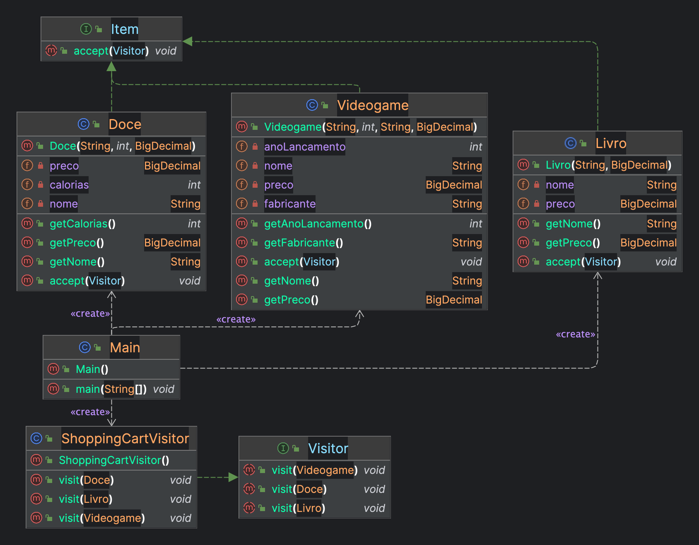
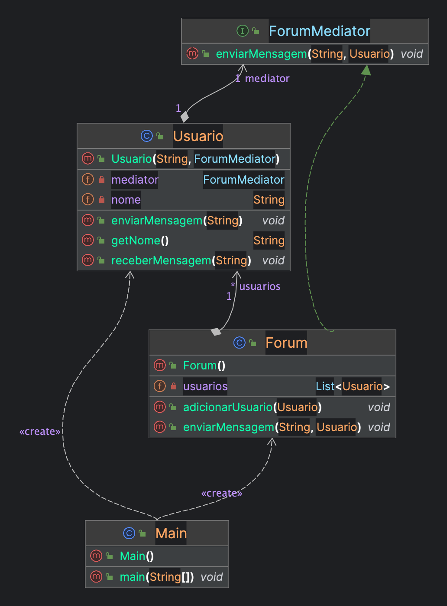

# Seminário de POO: Padrões de Projeto


## **Introdução**

Padrões de projeto representam um conjunto valioso de melhores práticas que evoluíram ao longo do tempo para enfrentar desafios recorrentes no desenvolvimento de software. Ao adotar esses padrões, os desenvolvedores podem criar sistemas mais robustos, compreensíveis e flexíveis. Em um contexto Java, esses padrões desempenham um papel crucial na criação de código modular e de fácil manutenção.

**Objetivo dos Padrões de Projeto:**

- Os padrões de projeto têm como objetivo fornecer soluções testadas e comprovadas para problemas comuns, oferecendo um guia para o desenvolvimento eficiente e eficaz de software.
- Ao implementar esses padrões, os desenvolvedores podem otimizar a arquitetura de seus sistemas, reduzindo a duplicação de código e promovendo a reutilização.

**Categorias de padrões de projeto**

Padrões de projeto são divididos em três categorias:

- **Padrões de Criação:**
    - Essa categoria trata da criação de objetos de maneira flexível e eficiente. Padrões como o Singleton garantem a existência de uma única instância de uma classe, enquanto os padrões de fábrica oferecem uma interface para a criação de objetos, delegando a decisão sobre o tipo de objeto a ser instanciado.
- **Padrões Estruturais:**
    - Os padrões estruturais concentram-se na composição de classes e objetos para formar estruturas mais complexas. Um exemplo notável é o padrão Adapter, que permite a integração de interfaces incompatíveis, tornando-as interoperáveis.
- **Padrões Comportamentais:**
    - Esta categoria lida com a comunicação eficiente entre objetos e a distribuição de responsabilidades. O padrão Observer, por exemplo, permite que objetos observadores sejam notificados sobre mudanças em um objeto sujeito, promovendo a desacoplação.

**Exemplos de padrões de projeto**

Alguns exemplos de padrões de projeto incluem:

- **Padrões comportamentais:**
    - Chain of Responsibility
    - Visitor
    - Mediator

- **Padrões de criação:**
    - Factory Method
    - Abstract Factory
    - Singleton

- **Padrões estruturais:**
    - Adapter
    - Bridge
    - Composite

### **Padrão Visitor**

O padrão Visitor é um padrão comportamental que permite definir uma operação nova sem alterar as classes dos elementos sobre os quais opera. Ele é particularmente útil quando se lida com uma hierarquia de classes complexa e se deseja realizar operações diferentes em objetos dessa hierarquia sem modificar suas classes.

**Componentes do Padrão Visitor:**

1. **Visitor (Visitante):**
    - Define uma interface que declara métodos de visita para cada tipo de elemento na hierarquia. Cada método de visita corresponde a um tipo específico de elemento.
2. **ConcreteVisitor (Visitante Concreto):**
    - Implementa a interface Visitor e fornece a implementação específica dos métodos de visita para realizar operações nos elementos concretos.
3. **Element (Elemento):**
    - Define uma interface que declara um método **`accept`** que permite que os visitantes acessem o elemento.
4. **ConcreteElement (Elemento Concreto):**
    - Implementa a interface Element e define a implementação específica do método **`accept`**, que invoca o método de visita apropriado no Visitor.
5. **ObjectStructure (Estrutura de Objetos):**
    - Representa a coleção ou a estrutura hierárquica de elementos sobre a qual as operações do Visitor serão realizadas. Fornece métodos para percorrer a estrutura.
    

**Funcionamento Básico:**

1. Um objeto da estrutura é passado para o Visitor, que, por sua vez, chama o método **`accept`** no objeto. Esse método **`accept`** é implementado em cada classe concreta e invoca o método de visita apropriado no Visitor.
2. O Visitor, por sua vez, possui métodos específicos para cada tipo de elemento. Esses métodos realizam as operações desejadas nos elementos sem alterar suas classes.

**Exemplo de aplicação:**

O padrão Visitor pode ser usado para implementar a funcionalidade de um carrinho de compras. No exemplo a seguir, temos um carrinho de compras que pode conter videogames, doces e livros.
<p align="center">
    
</p>

**Código-fonte do exemplo de Visitor em Java:**

```java
// Main.java
package com.paulofilipe;

import java.math.BigDecimal;
import java.util.ArrayList;

public class Main {
    public static void main(String[] args) {
        ShoppingCartVisitor visitor = new ShoppingCartVisitor();
        ArrayList<Item> itens = new ArrayList<>();

        itens.add(new Livro("Design Patterns", BigDecimal.valueOf(100)));
        itens.add(new Doce("Bolo de chocolate", 200, BigDecimal.valueOf(10)));
        itens.add(new Videogame("PS5", 2020, "Sony", BigDecimal.valueOf(4000)));

        for (Item item : itens) item.accept(visitor);
    }
}
```

```java
// Visitor.java
package com.paulofilipe;

public interface Visitor {
    void visit(Livro livro);
    void visit(Doce doce);
    void visit(Videogame videogame);
}
```

```java
// Item.java
package com.paulofilipe;

public interface Item {
    void accept(Visitor visitor);
}
```

```java
// ShoppingCartVisitor.java
package com.paulofilipe;

public class ShoppingCartVisitor implements Visitor {
    @Override
    public void visit(Livro livro) {
        System.out.println("Livro: " + livro.getNome()
                + ", Preço: " + String.format("%.2f", livro.getPreco()));
    }

    @Override
    public void visit(Doce doce) {
        // Prints the name and calories of the candy
        System.out.println("Doce: " + doce.getNome()
                + ", Calorias: " + doce.getCalorias()
                + ", Preço: " + String.format("%.2f", doce.getPreco()));
    }

    @Override
    public void visit(Videogame videogame) {
        // Prints the name and price of the videogame
        System.out.println("Videogame: " + videogame.getNome()
                + ", Ano de lançamento: " + videogame.getAnoLancamento()
                + ", Fabricante: " + videogame.getFabricante()
                + ", Preço: " + String.format("%.2f", videogame.getPreco()));
    }
}
```

```java
// Doce.java
package com.paulofilipe;

import java.math.BigDecimal;

public class Doce implements Item{
    @Override
    public void accept(Visitor visitor) {
        visitor.visit(this);
    }

    private final String nome;
    private final int calorias;
    private final BigDecimal preco;

    public Doce(String nome, int calorias, BigDecimal preco) {
        this.nome = nome;
        this.calorias = calorias;
        this.preco = preco;
    }

    public String getNome() {
        return nome;
    }

    public int getCalorias() {
        return calorias;
    }

    public BigDecimal getPreco() {
        return preco;
    }
}
```

```java
// Livro.java
package com.paulofilipe;

import java.math.BigDecimal;

public class Livro implements Item {
    @Override
    public void accept(Visitor visitor) {
        visitor.visit(this);
    }

    private final String nome;
    private final BigDecimal preco;

    public Livro(String nome, BigDecimal preco) {
        this.nome = nome;
        this.preco = preco;
    }

    public String getNome() {
        return nome;
    }

    public BigDecimal getPreco() {
        return preco;
    }
}
```

```java
// Videogame.java
package com.paulofilipe;

import java.math.BigDecimal;

public class Videogame implements Item{
    @Override
    public void accept(Visitor visitor) {
        visitor.visit(this);
    }
    private final String nome;
    private final int anoLancamento;
    private final String fabricante;
    private final BigDecimal preco;

    public Videogame(String nome, int anoLancamento, String fabricante, BigDecimal preco) {
        this.nome = nome;
        this.anoLancamento = anoLancamento;
        this.fabricante = fabricante;
        this.preco = preco;
    }

    public String getNome() {
        return nome;
    }

    public int getAnoLancamento() {
        return anoLancamento;
    }

    public String getFabricante() {
        return fabricante;
    }

    public BigDecimal getPreco() {
        return preco;
    }
}
```

**Explicação do código:**

1. `Main.java`: Esta é a classe principal que cria um `ShoppingCartVisitor` e uma lista de itens (`Livro`, `Doce` e `Videogame`). Cada item é visitado pelo `ShoppingCartVisitor` que imprime detalhes específicos sobre cada item.

2. `Visitor.java`: Esta é a interface do visitante que define três métodos de visitação, cada um correspondendo a um tipo de item.

3. `Item.java`: Esta é a interface do item que define um único método, `accept()`, que aceita um visitante.

4. `ShoppingCartVisitor.java`: Esta é a classe concreta do visitante que implementa a interface do visitante. Cada método de visitação imprime detalhes específicos sobre o item correspondente.

5. `Doce.java`, `Livro.java` e `Videogame.java`: Estas são as classes concretas dos itens que implementam a interface do item. Cada classe tem um método `accept()` que aceita um visitante e chama o método de visitação correspondente no visitante.

**Como a implementação do padrão Visitor funciona neste código:**

- Quando você executa o método `main` na classe `Main`, ele cria uma lista de itens e um `ShoppingCartVisitor`.
- Em seguida, ele itera sobre a lista de itens e para cada item, ele chama o método `accept()` do item, passando o `ShoppingCartVisitor` como argumento.
- O método `accept()` do item chama o método de visitação correspondente no visitante, passando a si mesmo como argumento.
- O método de visitação no visitante, então, imprime os detalhes específicos do item.

Este é um exemplo de como o padrão Visitor permite adicionar novas operações a classes existentes sem modificá-las. No exemplo acima, a operação de impressão dos detalhes de um item é uma nova operação que pode ser adicionada a qualquer classe de item existente sem modificar essas classes

### **Padrão Mediator**

O padrão Mediator é um padrão comportamental que facilita a comunicação entre objetos em um sistema, reduzindo as dependências diretas entre eles. Ele promove o desacoplamento ao centralizar a comunicação através de um objeto mediador, que gerencia as interações entre os participantes do sistema. Esse padrão é particularmente útil quando um conjunto de objetos precisa se comunicar de maneira complexa e evitar o acoplamento excessivo entre eles.

**Componentes do Padrão Mediator:**

1. **Mediator (Mediador):**
    - Define uma interface que declara métodos de comunicação entre os objetos participantes. O Mediator é responsável por coordenar e facilitar a interação entre esses objetos.
2. **ConcreteMediator (Mediador Concreto):**
    - Implementa a interface Mediator e fornece a lógica específica para coordenar as interações entre os participantes. O Mediador conhece e mantém referências para todos os objetos participantes.
3. **Colleague (Colega):**
    - Define uma interface que declara métodos que permitem a interação com outros objetos participantes. Os objetos Colleague conhecem o Mediador, mas não têm conhecimento direto uns dos outros.
4. **ConcreteColleague (Colega Concreto):**
    - Implementa a interface Colleague e define a funcionalidade específica do objeto. Os objetos ConcreteColleague interagem entre si por meio do Mediador, sem precisar conhecer detalhes internos uns dos outros.
    

**Funcionamento Básico:**

1. Quando um objeto Colleague precisa se comunicar com outros participantes, ele chama o método correspondente no Mediador.
2. O Mediador, por sua vez, gerencia a comunicação, direcionando as chamadas aos métodos apropriados nos objetos participantes.
3. Isso permite que os objetos Colleague permaneçam desacoplados, pois não precisam conhecer uns aos outros. A lógica de comunicação é centralizada no Mediador.
4. O uso do padrão Mediator facilita a manutenção do sistema, pois as alterações na lógica de comunicação são realizadas no Mediador, sem afetar diretamente os objetos participantes.

O padrão Mediator promove um design mais flexível e extensível, tornando-o adequado para sistemas onde a comunicação entre objetos é complexa e sujeita a mudanças frequentes.

**Exemplo de aplicação:**

O padrão Mediator pode ser usado para implementar a funcionalidade de um forum. No exemplo a seguir, temos um forum em que um usuário manda mensagem e todos os outros a vêem.
<p align="center">
    
</p>
**Código-fonte do exemplo de Mediator em Java:**

```java
// Main.java
package com.paulofilipe;

public class Main {
    public static void main(String[] args) {
        Forum forum = new Forum();

        Usuario usuario1 = new Usuario("Ana Zaira", forum);
        Usuario usuario2 = new Usuario("Beatriz Yana", forum);
        Usuario usuario3 = new Usuario("Cecília Xerxes", forum);

        forum.adicionarUsuario(usuario1);
        forum.adicionarUsuario(usuario2);
        forum.adicionarUsuario(usuario3);

        usuario1.enviarMensagem("Olá a todos!");
        System.out.println();

        usuario2.enviarMensagem("E aí, pessoal?");
    }
}
```

```java
// ForumMediator.java
package com.paulofilipe;

public interface ForumMediator {
    void enviarMensagem(String mensagem, Usuario usuario);
}
```

```java
// Forum.java
package com.paulofilipe;

import java.util.ArrayList;
import java.util.List;

public class Forum implements ForumMediator {

    // Lista de usuários no fórum
    private List<Usuario> usuarios = new ArrayList<>();

    public void adicionarUsuario(Usuario usuario) {
        usuarios.add(usuario);
    }

    @Override
    public void enviarMensagem(String mensagem, Usuario usuario) {
        // Simulando lógica de encaminhamento da mensagem para todos os usuários
        System.out.println("Mensagem enviada para todos os usuários no fórum.");
        for (Usuario u : usuarios) {
            if (u != usuario) {  // Não enviar a mensagem para o remetente
                u.receberMensagem(mensagem);
            }
        }
    }
}
```

```java
// Usuario.java
package com.paulofilipe;

public class Usuario {
    private String nome;
    private ForumMediator mediator;

    public Usuario(String nome, ForumMediator mediator) {
        this.nome = nome;
        this.mediator = mediator;
    }

    public String getNome() {
        return nome;
    }

    public void enviarMensagem(String mensagem) {
        System.out.println(nome + " enviou uma mensagem: " + mensagem);
        mediator.enviarMensagem(mensagem, this);
    }

    public void receberMensagem(String mensagem) {
        System.out.println(nome + " recebeu a mensagem: " + mensagem);
    }
}
```

**Explicação do código:**

1. **Main.java**: Este é o ponto de entrada do programa. Ele cria um objeto `Forum`, três objetos `Usuario` e os adiciona ao fórum. Em seguida, um usuário envia uma mensagem para todos os outros usuários no fórum.
2. **ForumMediator.java**: Esta é a interface do mediador. Define um método `enviarMensagem` que será implementado por qualquer classe que implemente essa interface.
3. **Forum.java**: Esta é a classe concreta do mediador. Ela mantém uma lista de usuários e implementa o método `enviarMensagem` da interface `ForumMediator`. Quando uma mensagem é enviada, ela é recebida por todos os outros usuários no fórum, exceto pelo usuário que a enviou.
4. **Usuario.java**: Esta é a classe concreta dos colaboradores. Cada usuário tem um nome e um mediador. Quando um usuário envia uma mensagem, ele a passa para o mediador, que então a encaminha para todos os outros usuários.

**Exemplo de como o código funciona:**

- Quando o usuário Ana Zaira envia a mensagem "Olá a todos!", o método `enviarMensagem` da classe `Usuario` é chamado. Isso, por sua vez, chama o método `enviarMensagem` do mediador, que é a classe `Forum`.
- O `Forum` então envia a mensagem para todos os outros usuários no fórum, exceto para Ana Zaira, que é o usuário que enviou a mensagem.
- Quando Beatriz Yana envia a mensagem "E aí, pessoal?", o processo é repetido.

Essa implementação do padrão Mediator permite que os usuários se comuniquem entre si sem se referirem diretamente um ao outro, o que reduz o acoplamento entre as classes `Usuario` e `Forum`.

## **Referências:**

1. Baeldung. Mediator Design Pattern in Java. Disponível em: [https://www.baeldung.com/java-mediator-pattern](https://www.baeldung.com/java-mediator-pattern). Acesso em: 09 de Dezembro de 2023.
2. Baeldung. Visitor Design Pattern in Java. Disponível em: [https://www.baeldung.com/java-visitor-pattern](https://www.baeldung.com/java-visitor-pattern). Acesso em: 09 de Dezembro de 2023.
3. DigitalOcean. Implementing the Mediator Design Pattern in Java. Disponível em: [https://www.digitalocean.com/community/tutorials/mediator-design-pattern-java](https://www.digitalocean.com/community/tutorials/mediator-design-pattern-java). Acesso em: 09 de Dezembro de 2023.
4. DigitalOcean. Java Design Patterns - Example Tutorial. Disponível em: [https://www.digitalocean.com/community/tutorials/java-design-patterns-example-tutorial](https://www.digitalocean.com/community/tutorials/java-design-patterns-example-tutorial). Acesso em: 09 de Dezembro de 2023.
5. Refactoring Guru. Mediator in Java - Padrão de Projeto Mediator. Disponível em: [https://refactoring.guru/pt-br/design-patterns/mediator/java/example](https://refactoring.guru/pt-br/design-patterns/mediator/java/example). Acesso em: 09 de Dezembro de 2023.
